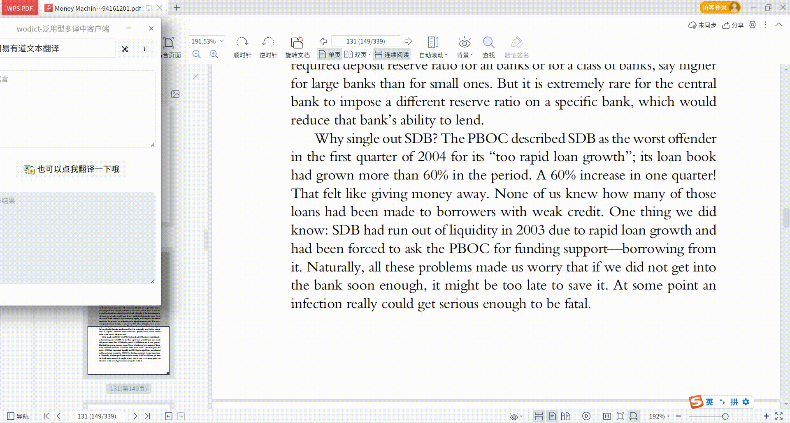
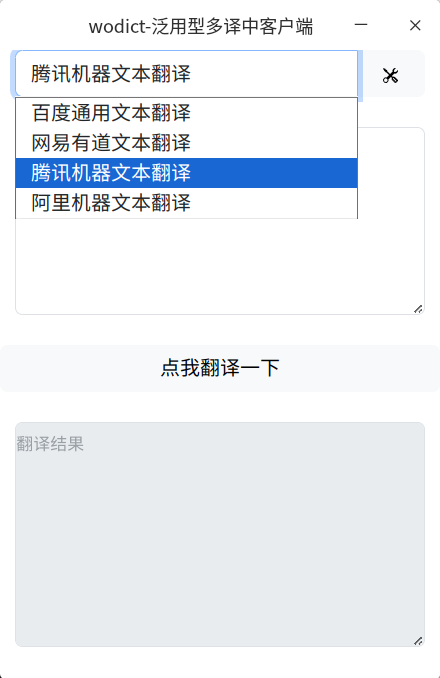
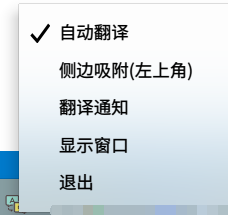

# wodict

wodict是一个基于electron开发的网络环境下泛用型翻译（词典）工具，支持通过配置的方式接入百度翻译开放平台、网易有道翻译等。支持的语言由翻译引擎决定，只要翻译引擎支持，对应的语言就能翻译，包括但不限于英文、日语、韩语等。

开发的初衷是做一个可以支持读取剪贴板字符进行翻译的小玩意，便于自己阅读文献。

我在学习一门新技术的时候，都会边学边做一个小东西，wodict是在我学rust的时候开始计划做的小东西，经过几周精神折磨后，我放弃了。但我的需求还在，我需要一个方便我阅读各种文档的翻译辅助工具，所以我开始学electron，这次很顺利，感谢javascript的世界对我这种庸人如此宽容的接纳。

## 已在以下系统测试
- 统信UOS家庭版V22.0 x86
- Ubuntu22.04 x86

## 效果
### 主面板

### 隐入左上角

### 翻译通知


## 安装

### 源代码编译
拉取代码
```
git clone https://github.com/unclemcz/wodict.git
npm install
npm start
```
打包
```
npm run make
```

### 二进制安装
[releases](https://github.com/unclemcz/wodict/releases)

## 使用
### 图形界面配置
打开配置窗口，填入参数，返回主界面选择引擎。



### 通过配置文件配置
获取平台授权（方式见下文各翻译引擎介绍），运行程序，将授权信息填入配置文件，然后**关闭程序再打开**一下，就能使用了。

### 托盘菜单说明


#### 自动翻译
默认勾选，选中后会自动监测剪切板变化（复制操作），有变化则自动翻译复制的文本。

#### 侧边吸附（左上角）
默认不勾选，同样无法固化，如果需要固化，在配置文件改写这个属性（wininto:true）。

#### 翻译通知
默认不勾选，选中后会通过系统通知栏弹出翻译结果，这个设置是临时的，程序重启后会恢复到false，需要系统通知的话，每次都要设置一下。

如果要永久保持这个设置，需要自己改配置文件的notification字段。
```
# ~/.config/wodict/config.json
{
    "notification":false,
    "curengine":"baidu",
    "baidu":{
        "name":"百度通用文本翻译",
        "appid":"",
        "key":""
    },
}
```


## 已支持列表

### 百度翻译开放平台
**标准版每月5万字符额度，高级版100万字符额度。**

注册后为标准版，认证后可以切换至高级版，需自己切换，无法自动切。
> 注意：百度翻译会吃字，有些敏感词比如大人物的名字，会被屏蔽，甚至整段翻译结果会不显示。

说明文档：https://api.fanyi.baidu.com/product/113
1. 注册开发者信息（https://api.fanyi.baidu.com/ ），获取APPID和秘钥。
2. 进行配置（https://fanyi-api.baidu.com/choose） ，开通通用文本翻译服务。
3. 将步骤1中的APPID和秘钥填入配置窗口。

### 网易有道翻译
**无定期免费额度，新用户赠送一定额度，用完即止**
> 注意：有道翻译同样有吃字的问题，注册后会收到推销电话。
1. 注册 https://ai.youdao.com/product-fanyi-text.s ，认证用户。
2. 创建应用，服务选项选择文本翻译，如果需要朗读，还需开通语音合成服务。
3. 将步骤2中的应用ID和秘钥填入配置窗口。

### 腾讯机器文本翻译
**文本翻译的每月免费额度为500万字符**
1. 注册 https://console.cloud.tencent.com/tmt
2. 新建秘钥 https://console.cloud.tencent.com/cam/capi
3. 将步骤2中生成的Id和key填入配置中。

### 阿里机器文本翻译通用版
**每月100万字符免费额度**
1. 注册  https://www.aliyun.com/product/ai/base_alimt
2. 新建秘钥 https://ram.console.aliyun.com/manage/ak
3. 将步骤2中生成的Id和key填入配置中。

### 火山引擎机器文本翻译
**每月200万字符免费使用额度**
> 注意：认证需要银行卡或者人脸认证。

介绍：https://www.volcengine.com/product/machine-translation
1. 注册认证：https://console.volcengine.com/user/authentication/
2. 开通申请：https://console.volcengine.com/finance/opening-service/translate/
3. 新建秘钥 https://console.volcengine.com/iam/keymanage/
4. 将步骤3中生成的Id和key填入配置中。


### 华为机器文本翻译
**每月100万字符免费使用额度**
> 注意：认证需要银行卡或者人脸认证，注册后会收到客服电话。

介绍：https://www.huaweicloud.com/product/nlpmt.html
1. 注册认证开通：https://console.huaweicloud.com/nlp/#/nlp/overview
2. 新建秘钥 https://console.huaweicloud.com/iam/#/mine/accessKey
3. 将步骤2中生成的Id和key填入配置中。

### ollama大模型工具
**需要本地化搭建**
> 仅在通义千问qwen大模型下测试。

介绍：https://ollama.com/
1. 按照ollama网站安装说明安装ollama和自己的大模型，例如qwen。
2. 确认ollama正常运行。
3. 将url和对应模型填入配置中。url默认为`http://127.0.0.1:11434/`,模型可参考ollama的网站，例如`qwen`、`qwen:7b`等。


## 增加引擎支持
欢迎通过pr的方式增加翻译引擎支持，说明：
1. 在lib/engine/下增加一个js文件，文件名建议为该引擎的公司名字，例如xxx.js，对外暴露一个translate()的异步函数。
```
async function translate(text,type,engine,win) {
    //todo
    //生成一个结果结构体 发送到win窗口
}
```
**结构体格式**

origintext: 原始文本

resulttext: 翻译后的文本

voice: 原始文本的语音合成文件链接（可选）

done:标记翻译是否已完成，为了兼容ollama引入，true为完成，false为未完成，false时翻译按钮会变灰，true时翻译按钮会变亮（可选）
```
{
    origintext:"",
    resulttext:"",
    voice:"",
    done:""
}
```
2. 修改~/.config/wodict/config.json，补充新引擎的秘钥信息。
```
# 普通翻译配置
"xxx":{
    "name":"xxxname",
    "appid":"",
    "key":""
}
# 大模型配置
"xxx":{
    "name":"xxxname",
    "url":"",
    "model":""
}
```
3. 修改lib/engine/translate.js，添加对新引擎的支持。
```
const xxx = require('./xxx.js');

async function translate(text,type,engine) {
    let result = {};
    if(type=="baidu"){
        result = await baidu.translate(text,engine);
    }else if(type=="xxx"){//
        result = await xxx.translate(text,engine);
    }else{
        result = {"origintext":text,"resulttext":"当前选择的翻译引擎为["+type+"]，还未配置，请先配置翻译引擎参数。"};
    }
}
```
4. 配置页面新增引擎元素 ./html/config.html
```
<div class="col-12">
<nav class="navbar bg-body-tertiary">
    <div class="">
    <svg width="24" height="24"><path></path></svg>
    <label id="xxxx-name">xxxx翻译</label>
    </div>
</nav>
</div>
<div class="col-6">
<input type="text" class="form-control" id="xxxx-id" placeholder="appid">
</div>
<div class="col-6">
<input type="password" class="form-control" id="xxxx-key" placeholder="key">
</div>  

```
5. 修改保存配置功能 ./rendererjs/config.js
```
//获取页面元素
const xxxxid = document.getElementById('xxxx-id');
const xxxxkey = document.getElementById('xxxx-key');
const xxxxname = document.getElementById('xxxx-name');

//显示到页面
window.electronAPI.onEngineList((value) => {
  for (const key in value) {
    if (value[key].name) {
      switch (key) {
        //
        case "volc":
          xxxxid.value = value[key].appid;
          xxxxkey.value = value[key].key;
          break;
        //
        default:
            break;
      }
    }
  }
})

//保存翻译引擎配置
const btnsavecfg = document.getElementById('btnsavecfg')
btnsavecfg.addEventListener('click', async () => {
  let cfg = {};
  //
  cfg.xxxx = {"name":xxxxname.innerText,"appid":xxxxid.value,"key":xxxxkey.value};
  //
  window.electronAPI.onSaveCfg(cfg);
  window.close();
})

```


## 还未支持的列表

### 微软Azure翻译
### amazon
### google
### deepl


## 隐私说明
wodict为纯客户端软件，使用过程中不需要连接wodict服务器，它也不会收集任何信息。

wodict使用到各种翻译引擎，这些引擎需要你自己申请与配置，wodict无法左右你所使用的翻译引擎本身的隐私处理行为，因此翻译引擎的隐私处理行为与wodict本身无关，wodict无法也不需对此做出保证。

