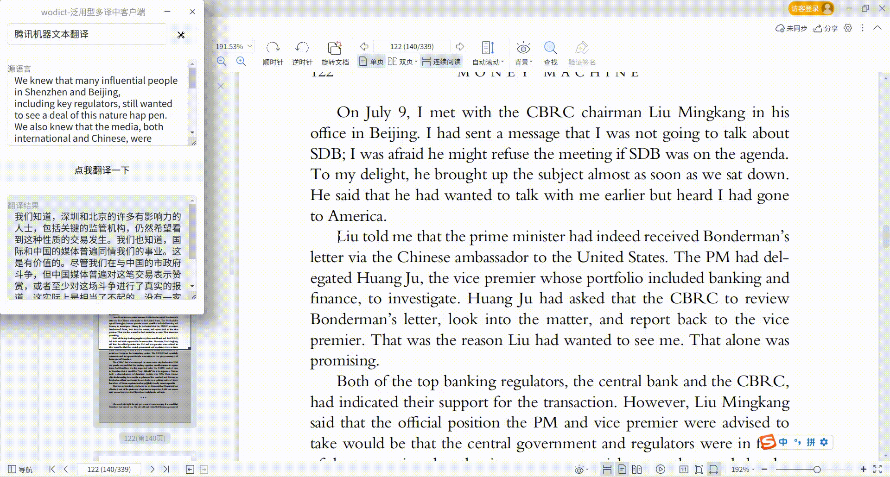

# wodict

wodict是一个基于electron开发的网络环境下词典工具，支持通过配置的方式接入百度翻译开放平台、网易有道翻译等。

开发的初衷是做一个可以支持读取剪贴板字符进行翻译的小玩意，便于自己阅读文献。

我在学习一门新技术的时候，都会边学边做一个小东西，wodict是在我学rust的时候开始计划做的小东西，经过几周精神折磨后，我放弃了。但我的需求还在，我需要一个方便我阅读各种文档的翻译辅助工具，所以我准备开始学electron，这次很顺利，感谢javascript的世界对我这种庸人如此宽容的接纳。

2016年前我在学nodejs的时候，开始做我现在还在运维的一个网站[公开真题库](https://www.gkzenti.cn)，那个网站的开发过程中犯了很多现在看来很弱智的错误，比如把html硬编码在代码里，学到一定时候才发现还有模板这种东西。所以wodict在开发过程中，一定会有一些看起来很低级的代码错误，没办法，这就是非科班出生资质平又庸的新手会犯的错吧（这个借口找的好^_^）。


## 效果


## 安装

### 源代码
```
git clone https://github.com/unclemcz/wodict.git
npm install
npm start
```
### 二进制(暂未提供)
会提供linux下的二进制可执行文件（x86与arm），其他平台请参考源代码安装方式。

## 使用
获取平台授权，将授权信息填入配置文件。

### 配置文件说明
主程序顶端有个翻译引擎切换下拉菜单选择，对应的是curengine。


托盘右键菜单中有个[翻译通知]，这个对应notification，用来设置是否把翻译推送到系统通知中，这个设置是临时的，程序重启后会恢复到false，需要系统通知的话，每次都要设置一下，这个是有意为之。


如果要永久保持这个设置，需要自己改配置文件。
```
# ~/.config/wodict/config.json
{
    "notification":false,
    "curengine":"baidu",
    "baidu":{
        "name":"百度通用文本翻译",
        "appid":"",
        "key":""
    },
    "youdao":{
        "name":"网易有道文本翻译",
        "appid":"",
        "key":""
    },
    "tencent":{
        "name":"腾讯机器文本翻译",
        "appid":"",
        "key":""
    },
    "alibase":{
        "name":"阿里机器文本翻译",
        "appid":"",
        "key":""
    }
}
```

## 已支持列表

### 百度翻译开放平台
**标准版每月5万字符额度，高级版100万字符额度。**
注册后为标准版，认证后可以切换至高级版，需自己切换，无法自动切。
说明文档：https://api.fanyi.baidu.com/product/113
1. 注册开发者信息（https://api.fanyi.baidu.com/ ），获取APPID和秘钥。
2. 进行配置（https://fanyi-api.baidu.com/choose） ，开通通用文本翻译服务。
3. 将步骤1中的APPID和秘钥填入配置窗口。

### 网易有道翻译
**无定期免费额度，新用户赠送一定额度，用完即止**
1. 注册 https://ai.youdao.com/product-fanyi-text.s ，认证用户。
2. 创建应用，服务选项选择文本翻译。
3. 将步骤2中的应用ID和秘钥填入配置窗口。

### 腾讯机器文本翻译
**文本翻译的每月免费额度为5百万字符**
1. 注册 https://console.cloud.tencent.com/tmt
2. 新建秘钥 https://console.cloud.tencent.com/cam/capi
3. 将步骤2中生成的Id和key填入配置中。

### 阿里机器文本翻译通用版
**每月100万字符免费额度**
1. 注册  https://www.aliyun.com/product/ai/base_alimt
2. 新建秘钥 https://ram.console.aliyun.com/manage/ak
3. 将步骤2中生成的Id和key填入配置中。


## 增加引擎支持
欢迎通过pr的方式增加翻译引擎支持，说明：
1. 在lib/engine/下增加一个js文件，文件名建议为该引擎的公司名字，例如xxx.js，对外暴露一个translate()的异步函数。
```
async function translate(query) {
    //todo
}
```
2. 修改~/.config/wodict/config.json，补充新引擎的秘钥信息。
```
"xxx":{
    "name":"xxxname",
    "appid":"",
    "key":""
}
```
3. 修改lib/engine/translate.js，添加对新引擎的支持。
```
const xxx = require('./xxx.js');

async function translate(text,type) {
    let result = {};
    if(type=="baidu"){
        result = await baidu.translate(text);
    }else if(type=="youdao"){
        result = await youdao.translate(text);
    }else if(type=="xxx"){//
        result = await xxx.translate(text);
    }else{
        result = {"origintext":text,"resulttext":"当前选择的翻译引擎为["+type+"]，还未配置，请先配置翻译引擎参数。"};
    }
    return result;
}
```


## 明确不会支持列表

### 微软Azure翻译
**注册过于繁琐，遂放弃。**

### amazon
同上

### 华为
接受通过提pr的方式增加。


## 隐私说明
wodict为纯客户端软件，使用过程中不需要连接wodict服务器，它也不会收集任何信息。

wodict使用到各种翻译引擎，这些引擎需要你自己申请与配置，wodict无法左右你所使用的翻译引擎本身的隐私处理行为，因此翻译引擎的隐私处理行为与wodict本身无关，wodict无法也不需对此做出保证。
